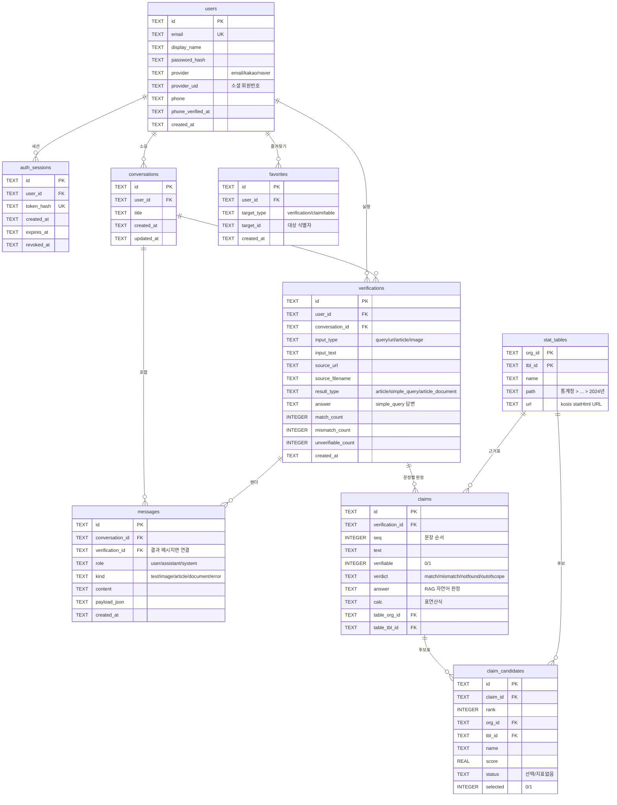

> **LEGACY_DO_NOT_IMPLEMENT**
>
> 이 문서는 SQLite/Bearer 기반의 과거 제안이며, 현재 PostgreSQL/Redis application DB
> 또는 적용 migration 정본이 아닙니다. 구현·migration·운영 판단의 근거로 사용하지 마세요.

# KOSIS 팩트체크 — 데이터베이스 ERD

프론트엔드 기능(로그인·검증·검증 기록·즐겨찾기·통계표 탐색·이미지 OCR)을 기준으로
설계한 스키마입니다. 아래 다이어그램은 GitHub·VS Code(Markdown Preview Mermaid)에서
그림으로 렌더됩니다.

- **기존 테이블**: `users`, `auth_sessions`, `conversations`, `messages`
- **제안(신규) 테이블**: `verifications`, `claims`, `claim_candidates`, `stat_tables`, `favorites`
- 채팅 로그(`conversations`/`messages`)는 **표시용**으로 유지하고, 검증 결과는
  구조화 테이블(`verifications`→`claims`→`claim_candidates`)에 **질의 가능**하게 저장합니다.



## 관계 요약

| 관계 | 의미 |
|---|---|
| users → auth_sessions | 사용자당 여러 Bearer 세션 |
| users → conversations / verifications / favorites | 사용자별 대화·검증·즐겨찾기 |
| conversations → messages | 대화 안의 말풍선들(표시용) |
| conversations → verifications | 대화 안에서 실행된 검증들 |
| verifications → claims | 검증 1건의 문장별 판정 |
| claims → claim_candidates | 문장별 후보 통계표(보통 5개) |
| stat_tables → claims / claim_candidates | KOSIS 표를 근거표·후보로 참조(dedup) |
| verifications → messages | 결과가 렌더된 말풍선(선택적 연결) |

## 설계 메모

- **정규화 채택**: 검증 기록 요약·판정별 필터·통계표 기준 조회·즐겨찾기가 프론트 핵심이라
  `claims`/`claim_candidates`로 펼침. 원본 재현이 필요하면 `verifications.raw_json` 컬럼을 덤으로.
- **stat_tables 마스터**: 같은 표를 여러 검증이 참조 → "이 표를 근거로 쓴 검증들", "통계표 탐색"이 쉬움.
- **favorites 폴리모픽**: 즐겨찾기 대상 3종(검증/문장/표)을 통합 테이블 1개로. `(user_id, target_type, target_id)` UNIQUE.
- **비로그인 검증**: 현재 익명 `/v1/analyze`는 미저장 → `verifications`는 로그인 사용자만.
  익명도 남기려면 `user_id` NULL 허용.
- **엔진**: 지금은 SQLite로 충분. 트래픽 증가 시 동일 스키마로 PostgreSQL 이전 용이.

## 제안 DDL (신규 테이블)

```sql
-- users 확장
ALTER TABLE users ADD COLUMN provider TEXT NOT NULL DEFAULT 'email';
ALTER TABLE users ADD COLUMN provider_uid TEXT;
ALTER TABLE users ADD COLUMN phone TEXT;
ALTER TABLE users ADD COLUMN phone_verified_at TEXT;

CREATE TABLE stat_tables (
  org_id TEXT, tbl_id TEXT,
  name TEXT NOT NULL, path TEXT, url TEXT,
  PRIMARY KEY (org_id, tbl_id)
);

CREATE TABLE verifications (
  id TEXT PRIMARY KEY,
  user_id TEXT REFERENCES users(id) ON DELETE CASCADE,
  conversation_id TEXT REFERENCES conversations(id) ON DELETE SET NULL,
  input_type TEXT NOT NULL,
  input_text TEXT NOT NULL,
  source_url TEXT, source_filename TEXT,
  result_type TEXT NOT NULL,
  answer TEXT,
  match_count INTEGER DEFAULT 0,
  mismatch_count INTEGER DEFAULT 0,
  unverifiable_count INTEGER DEFAULT 0,
  created_at TEXT NOT NULL
);
CREATE INDEX idx_verifications_user ON verifications(user_id, created_at DESC);

CREATE TABLE claims (
  id TEXT PRIMARY KEY,
  verification_id TEXT NOT NULL REFERENCES verifications(id) ON DELETE CASCADE,
  seq INTEGER NOT NULL,
  text TEXT NOT NULL,
  verifiable INTEGER NOT NULL,
  verdict TEXT,
  answer TEXT, calc TEXT,
  table_org_id TEXT, table_tbl_id TEXT,
  FOREIGN KEY (table_org_id, table_tbl_id) REFERENCES stat_tables(org_id, tbl_id)
);
CREATE INDEX idx_claims_verification ON claims(verification_id, seq);
CREATE INDEX idx_claims_verdict ON claims(verdict);

CREATE TABLE claim_candidates (
  id TEXT PRIMARY KEY,
  claim_id TEXT NOT NULL REFERENCES claims(id) ON DELETE CASCADE,
  rank INTEGER NOT NULL,
  org_id TEXT NOT NULL, tbl_id TEXT NOT NULL, name TEXT NOT NULL,
  score REAL, status TEXT, selected INTEGER DEFAULT 0
);
CREATE INDEX idx_candidates_claim ON claim_candidates(claim_id, rank);

CREATE TABLE favorites (
  id TEXT PRIMARY KEY,
  user_id TEXT NOT NULL REFERENCES users(id) ON DELETE CASCADE,
  target_type TEXT NOT NULL,
  target_id TEXT NOT NULL,
  created_at TEXT NOT NULL,
  UNIQUE(user_id, target_type, target_id)
);
CREATE INDEX idx_favorites_user ON favorites(user_id, created_at DESC);

-- messages → verifications 연결 컬럼(선택)
ALTER TABLE messages ADD COLUMN verification_id TEXT REFERENCES verifications(id) ON DELETE SET NULL;
```
