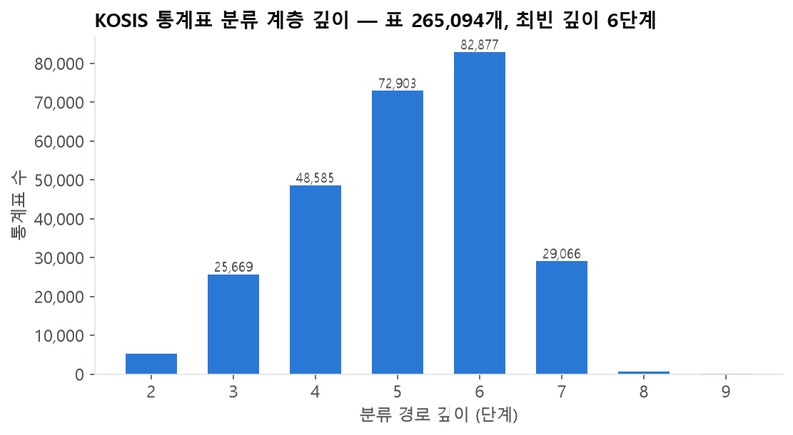
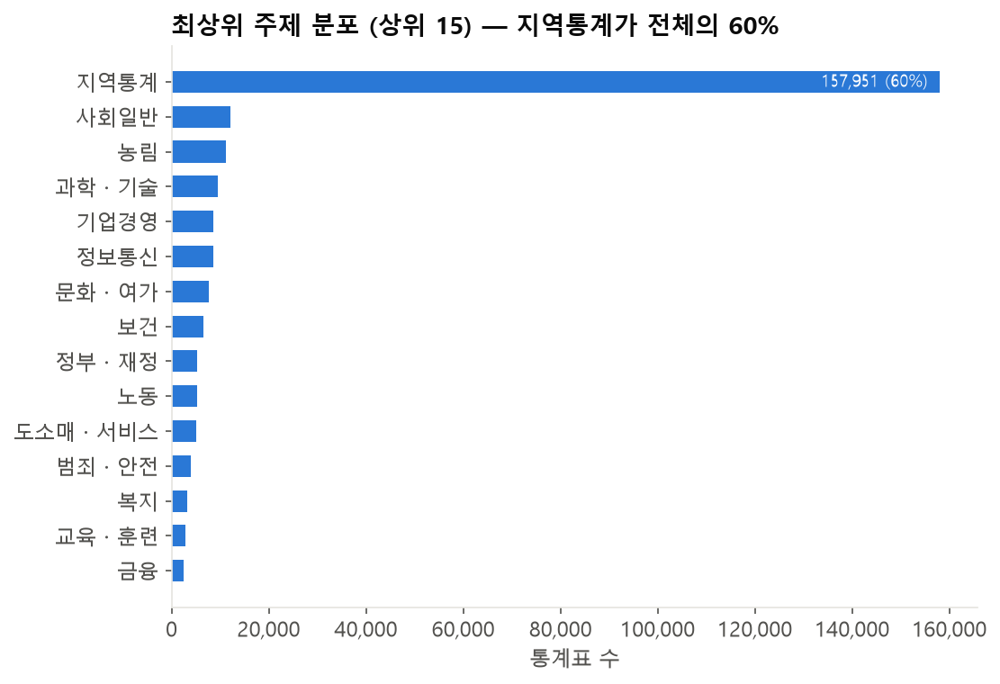
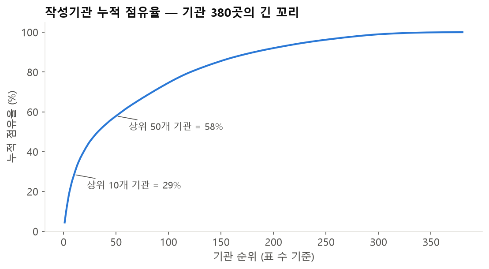
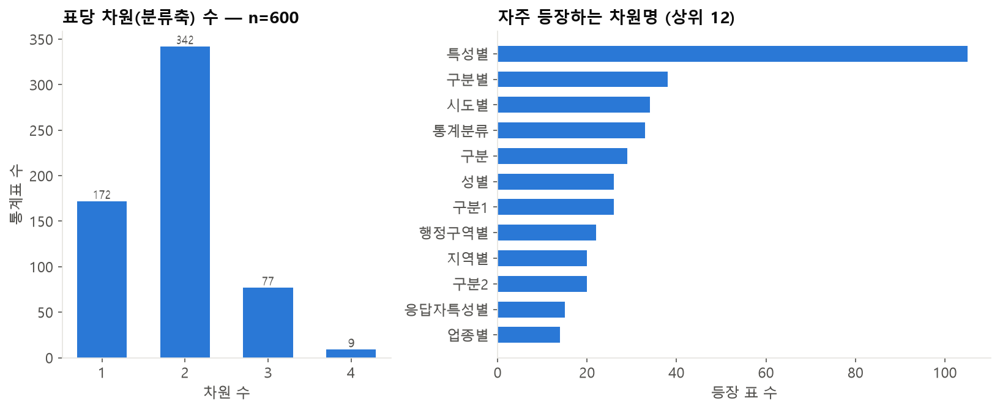
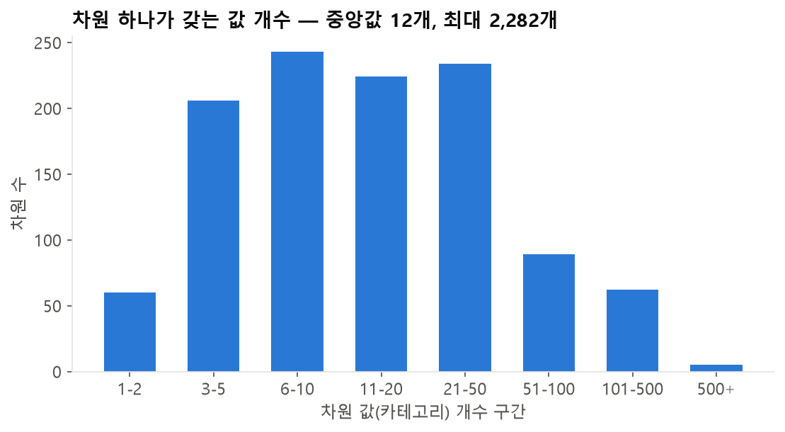
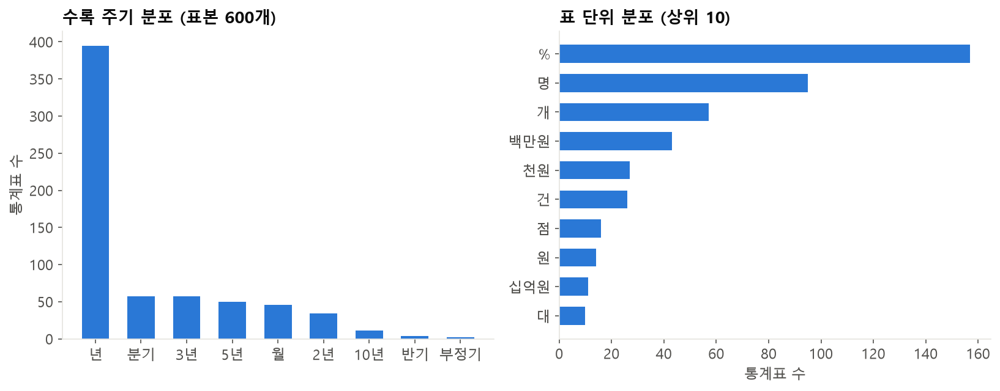
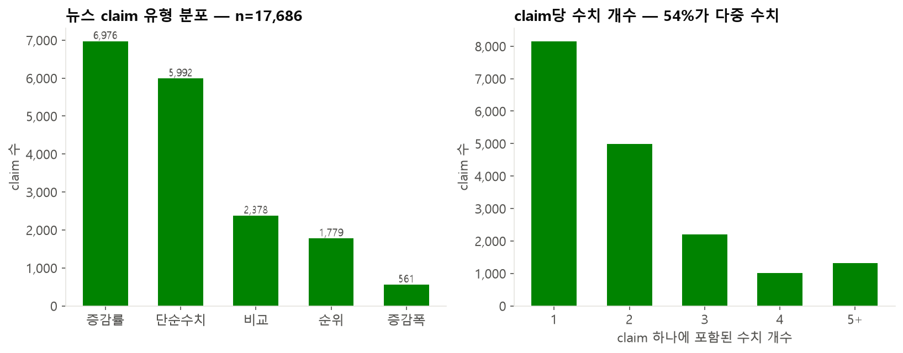
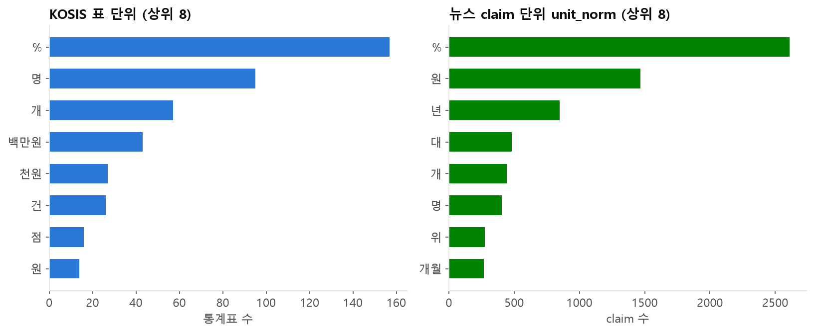

# KOSIS 통계표 EDA → 주장(Claim) 구조화 스토리

작성일: 2026-07-23
생성 코드: `src/kosis_eda.py` → `reports/figures/eda_fig01~08*.png`, `reports/figures/eda_stats.json`
데이터: `data/kosis_catalog_v1.jsonl`(전체 265,094표), `data/kosis_catalog_v2_sample600.jsonl`(메타 보강 표본 600표), `data/claims_v1.jsonl`(claim 17,686건)

---

## 발표 한 줄 메시지

> **"뉴스 문장을 KOSIS로 검증하려면, 뉴스 claim을 'KOSIS 통계표가 생긴 모양대로' 구조화해야 한다.
> 그래서 통계표 26.5만 개를 먼저 EDA했고, 거기서 발견한 5가지 특성이 그대로 claim 스키마의 5개 필드군이 되었다."**

---

## 스토리 흐름 (슬라이드 순서)

### Slide 1. 문제 제기 — 왜 EDA부터 했나

- 목표: 뉴스 기사 속 수치 주장을 KOSIS 공식 통계로 사실검증
- 뉴스 문장은 자연어, KOSIS는 API 파라미터(orgId, tblId, itmId, objL1...)로 조회하는 정형 데이터
- **둘을 연결하는 중간 표현(스키마)을 설계하려면, 먼저 "KOSIS 표가 어떻게 생겼는지"를 알아야 함**
- → 통계표 265,094개 전수 카탈로그 + 600개 표본 메타 보강으로 EDA 수행

### Slide 2. 발견 ① 표는 깊은 계층 속에 숨어 있다 — `eda_fig01`

- 표 265,094개가 **2~9단계 분류 계층**에 분산, 최빈 깊이는 **6단계**
- 표 이름만으로는 못 찾음 — "출생아 수" 같은 표가 `인구 > 인구동향조사 > 출생 > ...` 깊숙이 존재
- **→ 설계 반영**: 표를 flat한 검색 문서로 펴는 카탈로그(`build_kosis_catalog.py`)를 만들고,
  `doc_meta_text`에 표 이름 + **분류 경로 전체**를 넣어 임베딩·BM25 검색이 계층을 타지 않고도 닿게 함

### Slide 3. 발견 ② 주제·기관이 극단적으로 쏠려 있다 — `eda_fig02`, `eda_fig03`

- **지역통계가 전체의 60%**(157,951개) — 같은 지표가 시도·시군구 단위로 무한 복제됨
- 작성기관 **380곳**: 상위 10곳이 29%, 나머지는 긴 꼬리
- 뉴스가 말하는 "전국 실업률"과 "OO시 실업률" 표는 이름이 거의 같음 → 오매칭 위험
- **→ 설계 반영**: claim에 `source_scope`(전국/지역/기관 범위)와 출처 필드(`attributions`)를 별도 축으로 둠.
  검색 후보를 고를 때 기관·범위로 필터링 가능하게 함

### Slide 4. 발견 ③ 표는 '값 하나'가 아니라 '차원의 격자'다 — `eda_fig04`, `eda_fig06`

- 표의 71%가 **2개 이상의 차원**(특성별 × 시도별 × 성별 ...)을 가짐 (표본 600개 기준)
- 차원 하나의 값 개수는 중앙값 12개, 최대 **2,282개** — 표 하나가 수천 개 셀
- 자주 등장하는 차원: **특성별·구분별** 같은 범용 축이 최다이고, **성별·시도별·행정구역별**도 상위권 —
  뉴스가 흔히 언급하는 단서(성별·지역)와 그대로 맞물림
- **→ 설계 반영**: claim 스키마에 `population_raw/norm`(모집단)과
  observation의 `dimension_json`을 둠. "여성 청년 실업률"이라는 문장에서
  성별=여성, 연령=청년을 구조화해 두면 표의 차원 축에 그대로 대응됨

### Slide 5. 발견 ④ 시간과 단위에 표준 어휘가 있다 — `eda_fig05`

- 수록 주기는 **년(최다) 중심**에 분기·월·3년·5년 등으로 이어지는 소수 표준 어휘로 수렴
- 단위도 %, 명, 개, 백만원, 천원, 건 등 소수 어휘로 수렴 (표당 항목 최대 30종)
- 뉴스의 "지난해", "올 1분기" 같은 상대 시점은 이 주기 체계로 번역돼야 API 조회 가능
- **→ 설계 반영**: claim에 `period_type`(year/month/quarter), `time_start/time_end`(절대 시점 변환),
  `unit_raw/unit_norm`(단위 정규화) 필드를 둠 (`claim_normalizer.py`)

### Slide 6. 발견 ⑤ 뉴스 쪽 분포가 설계를 재확인해줌 — `eda_fig07`, `eda_fig08`

- claim 17,686건 중 **증감률(39%) + 비교(13%) + 증감폭(3%)** — 절반 이상이 값 2개 이상을 요구하는 주장
- 실제로 **claim의 54%가 다중 수치** 포함
- 단위 어휘 비교: KOSIS 표는 %와 함께 **절대량·금액(명, 개, 백만원, 천원)** 이 폭넓게 분포하는 반면,
  뉴스 claim은 **%·원에 극단적으로 쏠림** — 뉴스는 원자료보다 **파생값(증감률·비중)** 을 말한다는 뜻
  → 표의 절대량 셀을 그대로 대조하는 것만으로는 검증 불가
- **→ 설계 반영**:
  - claim 1건 : observation N건 구조 (`observations[]`) — 수치마다 시점·단위·차원을 따로 보존
  - `change_type`(단순수치/증감률/증감폭/비교/순위)과 `comparison_*`, `time_compare_*` 필드 —
    검증 시 "두 시점 값을 가져와 증감률을 계산"하는 경로를 스키마 수준에서 지원
  - `raw_value_list`/`raw_unit_list`로 원본 다중 수치를 임의 축약 없이 보존

### Slide 7. 종합 — EDA 발견 ↔ 스키마 필드 대응표

| # | EDA 발견 (KOSIS 통계표) | 근거 그림 | 구조화 설계 (Claim/Catalog 스키마) |
|---|---|---|---|
| ① | 표 26.5만 개, 분류 6단계 계층 | fig01 | flat 카탈로그 + `doc_meta_text`(이름+경로) 검색 문서화 |
| ② | 지역통계 60%, 기관 380곳 쏠림 | fig02, 03 | `source_scope`, `attributions`로 범위·출처 축 분리 |
| ③ | 표의 71%가 다차원 격자 (특성·성별·지역) | fig04, 06 | `population_*`, `dimension_json`으로 차원 단서 구조화 |
| ④ | 주기 5종·단위 소수 어휘로 수렴 | fig05 | `period_type`, `time_start/end`, `unit_norm` 정규화 |
| ⑤ | 뉴스 claim 54%가 다중 수치, 증감률 최다 | fig07, 08 | claim:observation = 1:N, `change_type`, 비교 필드 |

### Slide 8. 마무리 멘트

- 스키마는 "이론적으로 좋아 보여서"가 아니라 **양쪽 데이터의 분포를 보고 역설계**한 것
- 이후 파이프라인(HCX 구조화 실험, Qdrant 색인, 하이브리드 검색+리랭커)은 모두 이 스키마 위에서 동작
- 남은 과제: 메타 보강 표본 600개 → 전체 확대, 파생 단위 정규화 사전 확장

---

## 발표 시 예상 질문 대비

**Q. 600개 표본으로 차원 구조를 일반화해도 되나?**
A. 차원·항목 메타는 표별 API 호출(`getMeta`)이 필요해 전체 26.5만 표 중 600개를 무작위 표본으로 뽑아 보강했다. 분류 깊이·주제·기관 분포는 전체 265,094개 전수 기준이고, 차원·주기·단위 통계는 "600개 표본 기준"이라고 한정해 말하면 안전하다. 표본이 특정 도메인에 치우치지 않아(특성별·업종별·시도별 등 다양) 전체 경향을 대표하기에 무리가 없다.

**Q. 왜 표 이름 매칭으로 안 하고 스키마를 만들었나?**
A. fig02가 근거 — 지역통계 60% 때문에 같은 이름의 표가 지역 단위로 수백 개 존재한다. 이름 매칭은 오매칭을 양산하고, 범위·시점·차원까지 맞아야 올바른 셀에 도달한다.

**Q. 증감률 claim은 어떻게 검증하나?**
A. `change_type=증감률` + `time_compare_*` 필드가 있으면 두 시점 값을 KOSIS에서 각각 조회해 증감률을 계산·대조한다. 스키마가 이 계산 경로를 명시적으로 지원하도록 설계했다.
